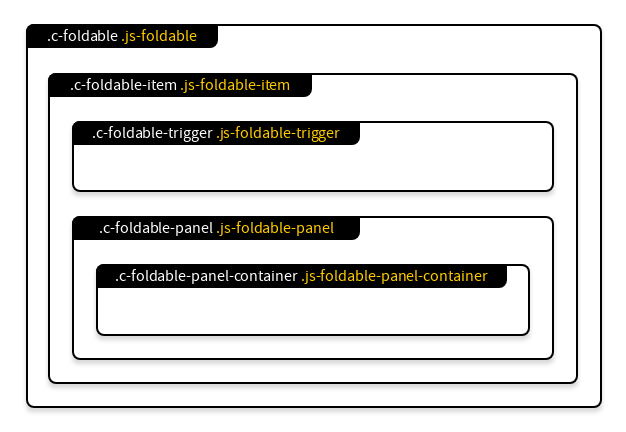

# Foldable+

Just a basic responsive animated nestable accessible collapsible that can behave like an accordion.

## Structure


```txt
.c-c-foldable.js-foldable
└── .c-foldable-item.js-foldable-item
    ├── .c-foldable-trigger.js-foldable-trigger
    └── .c-foldable-panel.js-foldable-panel
        └── .c-foldable-panel-container.js-foldable-panel
```

## Features

- [x] Responsive
- [x] Animated
- [x] Nested blocks
- [ ] A11y
- [ ] Limits
- [x] Open by default
- [ ] Accordion behaviour

## Examples
